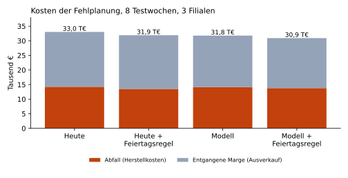
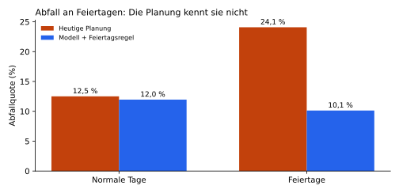

# 🥖 bakery-demand-forecast

**Absatzprognose und Produktionsplanung für Bäckereien: Wie viel soll morgen gebacken werden?**

Python · pandas · scikit-learn · matplotlib · pytest

Fortsetzung von [bakery-sales-db](https://github.com/Mohammadmahdi-Nemati/bakery-sales-db), der PostgreSQL-Datenbank
mit 6 Monaten Verkaufs-, Produktions- und Abfalldaten von drei Bäckerei-Filialen.

---

## Ergebnis in Kürze

In den 8 Testwochen (04.05. bis 30.06.2026) senkt die neue Planung die Kosten der Fehlplanung
(Abfall + entgangene Verkäufe) um **6,4 %**, von 33.034 € auf 30.918 €. Der Gewinn steigt um 2.116 €.



**Die wichtigste Erkenntnis ist nicht das Machine-Learning-Modell, sondern eine einfache Fachregel.**
An Feiertagen kaufen Kunden wie an einem Sonntag, die bisherige Planung schaut aber nur auf den Wochentag.
Plant man Feiertage wie Sonntage, sinkt die Abfallquote dort von 24,1 % auf 10,1 %.



| Planungsregel | Abfallquote | Lieferfähigkeit | Kosten der Fehlplanung |
|---|---|---|---|
| Heute: Ø letzte 4 gleiche Wochentage + 12 % | 13,0 % | 92,9 % | 33.034 € |
| Heute + Feiertagsregel | 12,4 % | 93,3 % | 31.908 € |
| Modell + Newsvendor-Menge | 12,3 % | 92,9 % | 31.778 € |
| **Modell + Newsvendor + Feiertagsregel** | **11,9 %** | **93,3 %** | **30.918 €** |

Alle Zahlen erzeugt `run.py` neu, ausführlich in [reports/results.md](reports/results.md).

## Das Problem

Eine Bäckerei legt am Vorabend fest, wie viel sie backt. Zu viel landet abends im Müll (Kosten: Herstellkosten).
Zu wenig heißt ausverkauft, und Kunden gehen ohne Kauf (Kosten: entgangene Marge).

Dazu kommt ein Messproblem: **An ausverkauften Tagen zeigt die Kasse nicht die Nachfrage, sondern nur den Bestand.**
Wer nur auf den Absatz schaut, unterschätzt die Nachfrage systematisch und plant immer zu knapp.

## Vorgehen

```
CSV-Dateien aus bakery-sales-db
        │
        ▼
1. Tagestabelle je Filiale × Produkt      data.py
2. Ausverkaufs-Korrektur                  censoring.py
3. Merkmale (nur Wissen bis zum Vortag)   features.py
4. Prognosemodelle                        models.py
5. Planungsregeln durchrechnen            evaluate.py
        │
        ▼
reports/results.md + Diagramme            run.py
```

**1. Ausverkaufs-Korrektur.** An Tagen ohne Ausverkauf sieht man, welcher Anteil des Tagesabsatzes bis zu einer
Uhrzeit verkauft ist (z. B. Weizenbrötchen werktags: rund zwei Drittel bis 11 Uhr). Ist ein Produkt um 10:30 Uhr ausverkauft,
wird die Nachfrage hochgerechnet: *Absatz / Anteil bis 10:30*. Das senkt die Unterschätzung an Ausverkaufstagen
von 14,8 % auf 12,2 %. Den Rest kann die Methode nicht sehen: Kunden, die z. B. 10 Brötchen wollten und nur noch 3 bekamen.

**2. Prognosemodell.** Gradient Boosting (`HistGradientBoostingRegressor`) mit Filiale, Produkt, Kategorie,
Wochentag, Feiertag und den Durchschnitten der letzten 4 gleichen Wochentage bzw. Sonntage.
Getestet wird zeitlich sauber: Training bis 03.05., Test ab 04.05. Kein Merkmal nutzt Informationen vom Tag selbst.

**3. Wie viel backen? Das Newsvendor-Prinzip.** Die Prognose sagt, was im Mittel verkauft wird. Wie viel man backen sollte,
hängt aber von den Kosten ab. Ein übrig gebliebenes Weizenbrötchen kostet 0,12 € Herstellkosten,
ein fehlendes kostet 0,33 € entgangene Marge. Optimal ist deshalb das Quantil

```
q* = (Preis − Herstellkosten) / Preis = (0,45 − 0,12) / 0,45 ≈ 0,73
```

Die Menge soll also an 73 % der Tage reichen. Dafür werden Quantil-Modelle (q = 0,65 / 0,70 / 0,75) trainiert,
und jedes Produkt bekommt das passende.

**4. Bewertung.** Die Daten sind simuliert, deshalb ist die echte Nachfrage bekannt, auch an Ausverkaufstagen
(`true_demand.csv`, wird nur zur Bewertung genutzt, nie zum Training). So lässt sich jede Planungsregel fair durchrechnen:
Was wäre verkauft, weggeworfen und verloren worden?

## Was nicht funktioniert hat

- **Mehr Merkmale waren schlechter.** Mit Vortageswert (`lag_1`) und 7-Tage-Mittel lag der Prognosefehler (WAPE) bei 19,5 %,
  mit dem schlanken Merkmalsatz bei 18,9 %. Die Tagesschwankung der Kundenzahl ist reiner Zufall, mehr Merkmale lernen nur Rauschen.
- **Der Monat als Merkmal hat geschadet** (Unterschätzung um 10 % statt 5 %). Im Training gab es nur Januar bis April,
  für Mai und Juni konnte das Modell daraus nichts Sinnvolles lernen.
- **Das Modell lernt Feiertage nicht selbst.** Im Training gab es nur 3 Feiertage. Deshalb übernimmt an Feiertagen die
  Feiertagsregel.
- **Das Modell allein bringt wenig.** Gegenüber der heutigen Regel sinkt der Fehler nur von 19,7 % auf 18,9 %.
  Bei stark zufälliger Nachfrage ist ein guter Durchschnitt schon nah am Optimum.

## Grenzen

- Simulierte Daten: Die Muster stammen aus Beobachtungen in einer echten Bäckerei, die Zahlen nicht.
- Die Prognosen unterschätzen die Nachfrage im Mittel noch um rund 5 %, weil auch die korrigierten Werte an
  Ausverkaufstagen zu niedrig sind. Ein Zensierungsmodell (z. B. Tobit-Regression) wäre der nächste Schritt.
- 8 Testwochen mit 3 Feiertagen: Der Feiertagseffekt ist deutlich, die genaue Höhe aber unsicher.

## Starten

```bash
# 1. Daten erzeugen (einmalig)
git clone https://github.com/Mohammadmahdi-Nemati/bakery-sales-db.git
python3 bakery-sales-db/generator/generate_data.py

# 2. Prognose ausführen
git clone https://github.com/Mohammadmahdi-Nemati/bakery-demand-forecast.git
cd bakery-demand-forecast
pip install -r requirements.txt
python3 run.py --data-dir ../bakery-sales-db/data

# 3. Tests
pytest
```

## Projektstruktur

```
bakery-demand-forecast/
├── src/bakery_forecast/
│   ├── data.py        # CSV laden, Tagestabelle bauen
│   ├── censoring.py   # Ausverkaufs-Korrektur
│   ├── features.py    # Merkmale, heutige Planungsregel, Feiertagsregel
│   ├── models.py      # Gradient Boosting, Quantile, Newsvendor
│   ├── evaluate.py    # Planungsregeln durchrechnen, Kennzahlen
│   └── pipeline.py    # Gesamtablauf
├── tests/             # pytest mit nachrechenbaren Beispielen
├── reports/           # Ergebnisse und Diagramme (von run.py erzeugt)
└── run.py
```

---

Mohammadmahdi Nemati · Informatik-Student an der Heinrich-Heine-Universität Düsseldorf
